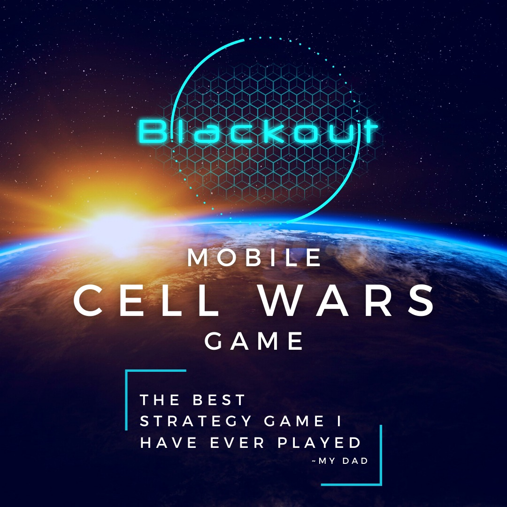
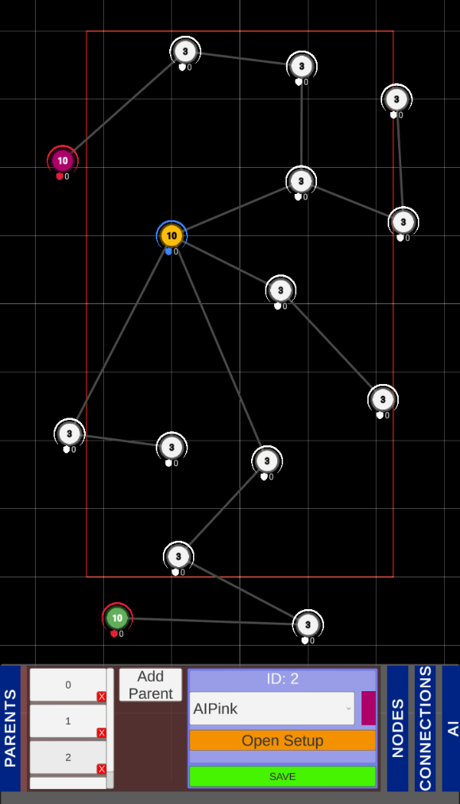
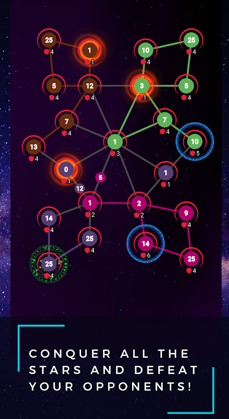
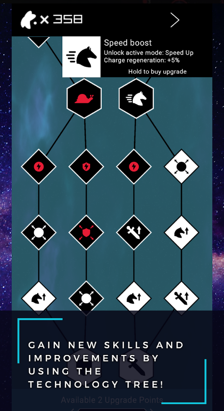

# Unity Mobile Game - Blackout: Cell Wars   

Pliki źródłowe mobilnej gry strategicznej o nazwie "Blackout: Cell Wars".  
Gra posiada **55** dostępnych do grania poziomów oraz została umieszczona w sklepie **Google Play**. 

Poniższe linki prowadzą prosto do sklepu Google Play gdzie dostępne są również postałe nasze produkcje do pobrania zupełnie za darmo :) 

[Link do strony z naszymi grami (GeekBox) - Google Play](https://play.google.com/store/apps/dev?id=6893354586300001935)  
[Link do strony z naszymi grami (CyberSkyGames) - Google Play](https://play.google.com/store/apps/dev?id=6955278336175220384)  

[**Link do pobrania gry - Google Play**](https://play.google.com/store/apps/details?id=com.GeekBox.Blackout)

## O grze

Inspiracją do gry były różnego rodzaju produkcje bazujące na mechanice przejmowania kolejnych terenów za pomocą wyprodukowanych jednostek. W celu urozmaicenia podstawewego pomysłu na tego typu rozgrywkę, zdecydowaliśmy się na implementację kilku funkcjonalności.

- Drzewo rozwoju - pozwalające na zakup modyfikatorów np. szybsza regeneracja tarczy lub dodatkowych specjalnych umiejętnośći.
- Specjalne umiejętności - możliwe do zakupu w grze po odblokowaniu w drzewie technologicznym.
 

### Specyfikacja wewnętrzna
W celu ułatwienia designerom projektowania poziomów, opracowany została funkcjonalności interaktywnego edytora do tworzenia kolejnych map. Specjalny edytor został również dodany w celu ustawienia drzewa technologicznego dostępnego w grze.  

W grze umieszczone zostały elementy:

- Autorska grafika elementów otoczenia oraz postaci.
- 55 przetestowanych poziomów.
- Integracja z siecią reklamową ADMOB oraz Google Play Services.
- Efekty dźwiękowe podczas rozgrywki.

### Technologie

Przy tworzeniu gry zostały wykorzystane następujące technologie:

- Unity - Silnik gry, na którym została w całości stworzona.
- C#    - Język programowania użyty do napisania logiki gry.
- Odin Inspector
- Sirenix Serializer
- Amplify
- DoTween
- More Performance Coroutines
- Easy Mobile Pro

## Przykłady z gry

### Widok edytora poziomów (narzędzia dla designerów)

### Przykład rozgrywki

### Widok drzewa technologicznego
 

[//]: # (Dummy comment to order repositories.)
